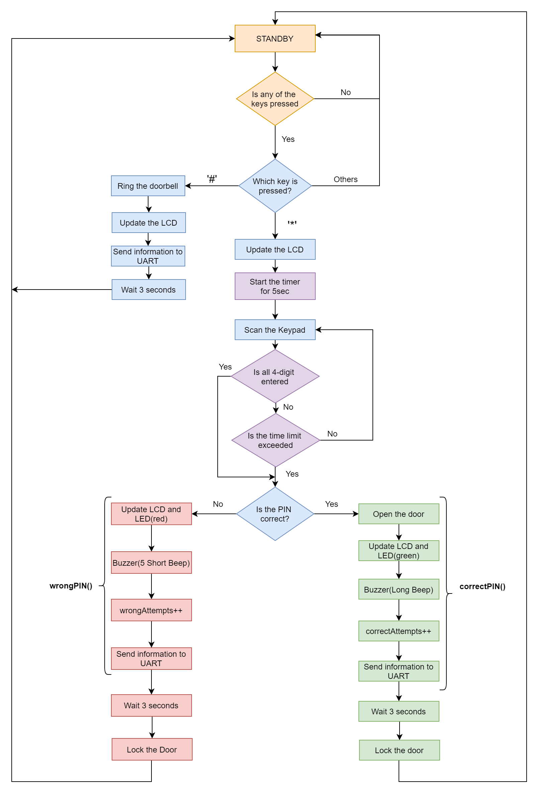

# Digital-Electronics-2 Final Project: Door Lock System   "The Mighty Dumbledoor :mage:"

 
### Team members

Demirkan Korbey Bağlamaç & Raşit Demirören

[Link to our GitHub project folder](https://github.com/dkorbey/Door-Lock-Project)

### Project objectives

This project mainly aims to implement a door lock system using the microcontroller ATmega328p and C programming language. 

Here you can find the flowchart of our program:

## Hardware description

* 1x Microcontroller [ATmega328p]
* 1x Display [Hd44780 (4x20)]
* 1x Keypad [4x3]
* 2x AudioOuts [1 as Buzzer, 1 as Door Bell]
* 2x LEDs [1 green, 1 red]
* 3x DC Voltage Sources [5v]
* 1x Relay [SPST]

## Code description and simulations

While implementing our code, we used several [libraries](https://github.com/dkorbey/Door-Lock-Project/tree/main/Libraries) from the previous laboratory exercises of this semester. (i.e. `uart.h`, `gpio.h`, `timer.h`, `lcd.h` etc.)
We also implemented our own library [keypad.h](https://github.com/dkorbey/Door-Lock-Project/blob/main/Dumbledoor/Dumbledoor/keypad.h) ([keypad.c](https://github.com/dkorbey/Door-Lock-Project/blob/main/Dumbledoor/Dumbledoor/keypad.c)) exclusively for this project. You can find the html documentation of our keypad
library created with doxygen [here](https://dkorbey.github.io/Door-Lock-Project/keypad_8h.html). 

You can find the `main.c` [here](https://github.com/dkorbey/Door-Lock-Project/blob/main/Dumbledoor/Dumbledoor/main.c).

List of libraries used in this application:
* [gpio.h](https://dkorbey.github.io/Door-Lock-Project/gpio_8h.html): For controlling AVR's gpio pins
* [lcd.h](https://dkorbey.github.io/Door-Lock-Project/lcd_8h.html): For using the LCD module
* [timer.h](https://dkorbey.github.io/Door-Lock-Project/timer_8h.html): For defining timers
* [uart.h](https://dkorbey.github.io/Door-Lock-Project/uart_8h.html): For using UART communication
* [keypad.h](https://dkorbey.github.io/Door-Lock-Project/keypad_8h.html): For using the keypad module
* avr/io.h: AVR device-specific IO definitions
* avr/interrupt.h: Interrupts standard C library for AVR-GCC
* stdlib.h: To use itoa() function, which transforms numerical variables to string

We use all 3 timers in our project, in the table below you can see why and with which prescaler we use the them,
|           TIMER          | PRESCALER |                                                                       REASON                                                                       |
|:------------------------:|:---------:|:---------------------------------------------------------------------------------------------------------------------------------------------------|
|      Timer/Counter0      |    4ms    | For scanning the keypad at every overflow,  and configure the sytem according the pressed key.                                                     |
|      Timer/Counter1      |     1s    | For creating counters (5s and 3s) which is used in the application,  for example it starts counting to 5 after the user start typing the password. |
|      Timer/Counter2      |    16ms   | To create PWM signals for buzzer and the door bell.                                                                                                |

The table of the functions used in this project:
|    FUNCTION NAME   |  PARAMETERS  |     RETURN   | APPLICATION                                                                                                                                                                                                                       |
|:------------------:|:------------:|:------------:|-----------------------------------------------------------------------------------------------------------------------------------------------------------------------------------------------------------------------------------|
|      standby()     |     none     |     none     | Configure the system for the standby state.  (Reset the typed pin and user ID, lock the door, reset the LEDs, etc.)                                                                                                               |
|   ringDoorBell()   |     none     |     none     | Rings the door bell.                                                                                                                                                                                                              |
|    correctPin()    |  uint8_t ID  |     none     | Runs when the correct pin is typed and configures the system accordingly. (Lights up the green led, unlock the door lock, activates buzzer, etc.)  Gets the user ID for printing the user's name on the LCD.                      |
|     wrongPin()     |     none     |     none     | Runs when the typed pin is wrong and configures the system accordingly. (Lights up the red led, lock the door, activates the buzzer, etc. )                                                                                       |
|    comparePins()   | char input[] | int8_t pinId | Gets the typed pin as a parameter and then compares the typed pin with the  defined correct pins and determine whether is it correct or not. And if the typed pin is correct returns the user id(pinID). If its wrong returns -1. |

## Video/Animation

Write your text here.

## References

1. [Keypad Tutorial 1](https://lastminuteengineers.com/arduino-keypad-tutorial/)
2. [Keypad Tutorial 2](https://www.geeksforgeeks.org/telephone-keypad-scanner/)
3. [Relay Switch Circuit](https://www.electronics-tutorials.ws/blog/relay-switch-circuit.html )
