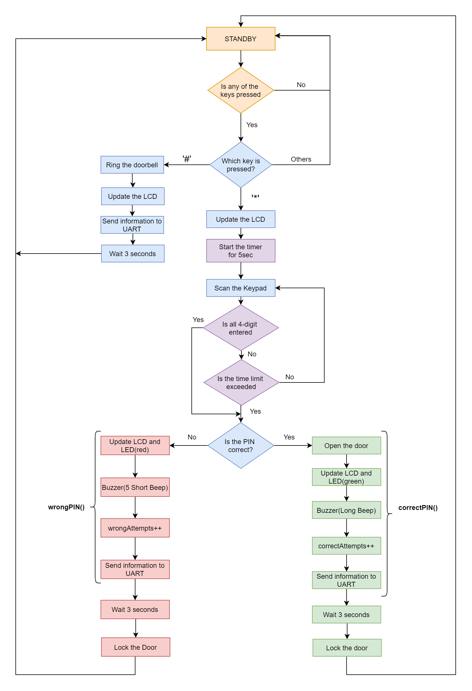

# Digital-Electronics-2 Final Project: Door Lock System   "The Mighty Dumbledoor :mage:"

 
### Team members

Demirkan Korbey Bağlamaç & Raşit Demirören

[Link to our GitHub project folder](https://github.com/dkorbey/Door-Lock-Project)

### Project objectives

This project mainly aims to implement a door lock system using the microcontroller ATmega328p and C programming language. 

Here you can find the flowchart of our program:

## Hardware description

* 1x Microcontroller [ATmega328p]
* 1x Display [Hd44780 (4x20)]
* 1x Keypad [4x3]
* 2x AudioOuts [1 as Buzzer, 1 as Door Bell]
* 2x LEDs [1 green, 1 red]
* 3x DC Voltage Sources [5v]
* 1x Relay [SPST]

## Code description and simulations

While implementing our code, we used several [libraries](https://github.com/dkorbey/Door-Lock-Project/tree/main/Libraries) from the previous laboratory exercises of this semester. (i.e. `uart.h`, `gpio.h`, `timer.h`, `lcd.h` etc.)
We also implemented our own library [keypad.h](https://github.com/dkorbey/Door-Lock-Project/blob/main/Dumbledoor/Dumbledoor/keypad.h) ([keypad.c](https://github.com/dkorbey/Door-Lock-Project/blob/main/Dumbledoor/Dumbledoor/keypad.c)) exclusively for this project. You can find the html documentation of our keypad
library created with doxygen [here](https://dkorbey.github.io/Door-Lock-Project/keypad_8h.html).

List of libraries used in this application:
* [gpio.h](https://dkorbey.github.io/Door-Lock-Project/gpio_8h.html): For controlling AVR's gpio pins
* [lcd.h](https://dkorbey.github.io/Door-Lock-Project/lcd_8h.html): For using the LCD module
* [timer.h](https://dkorbey.github.io/Door-Lock-Project/timer_8h.html): For defining timers
* [uart.h](https://dkorbey.github.io/Door-Lock-Project/uart_8h.html): For using UART communication
* [keypad.h](https://dkorbey.github.io/Door-Lock-Project/keypad_8h.html): For using the keypad module
* avr/io.h: AVR device-specific IO definitions
* avr/interrupt.h: Interrupts standard C library for AVR-GCC
* stdlib.h: To use itoa() function, which transforms numerical variables to string

We use all 3 timers in our project, in the table below you can see why and with which prescaler we use the timers,

## Video/Animation

Write your text here.

## References

1. [Keypad Tutorial 1](https://lastminuteengineers.com/arduino-keypad-tutorial/)
2. [Keypad Tutorial 2](https://www.geeksforgeeks.org/telephone-keypad-scanner/)
3. [Relay Switch Circuit](https://www.electronics-tutorials.ws/blog/relay-switch-circuit.html )
